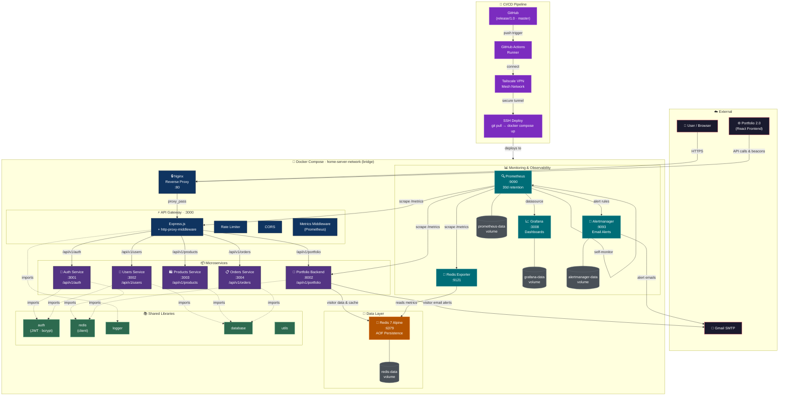

# Home Server

Microservices-based home server running on Docker Compose with a full observability stack, CI/CD pipeline, and shared libraries.

## Architecture



## Structure

| Directory | Description |
|---|---|
| `gateway/` | API Gateway — Express.js with rate limiting, CORS, proxy routing, Prometheus metrics |
| `services/auth-service/` | Authentication & authorization (JWT, password hashing) |
| `services/users-service/` | User management |
| `services/products-service/` | Product catalog |
| `services/orders-service/` | Order processing |
| `services/portfolio-backend/` | Portfolio API — skills, visitor tracking, email notifications |
| `Portfolio-2.0/` | React frontend for the portfolio site |
| `shared/` | Shared libraries — auth, redis, logger, database, utils |
| `infrastructure/nginx/` | Nginx reverse proxy configuration |
| `infrastructure/prometheus/` | Prometheus config & alert rules |
| `infrastructure/grafana/` | Grafana dashboard provisioning |
| `infrastructure/alertmanager/` | Alertmanager config & email templates |
| `.github/workflows/` | CI/CD — GitHub Actions deploy via Tailscale + SSH |
| `docs/` | Documentation |

## Getting Started

```bash
docker-compose up -d
```

## Ports

| Service | Port |
|---|---|
| Nginx | `:80` |
| API Gateway | `:3000` |
| Auth Service | `:3001` |
| Users Service | `:3002` |
| Products Service | `:3003` |
| Orders Service | `:3004` |
| Portfolio Backend | `:8002` |
| Redis | `:6379` |
| Prometheus | `:9090` |
| Grafana | `:3008` |
| Alertmanager | `:9093` |
| Redis Exporter | `:9121` |
